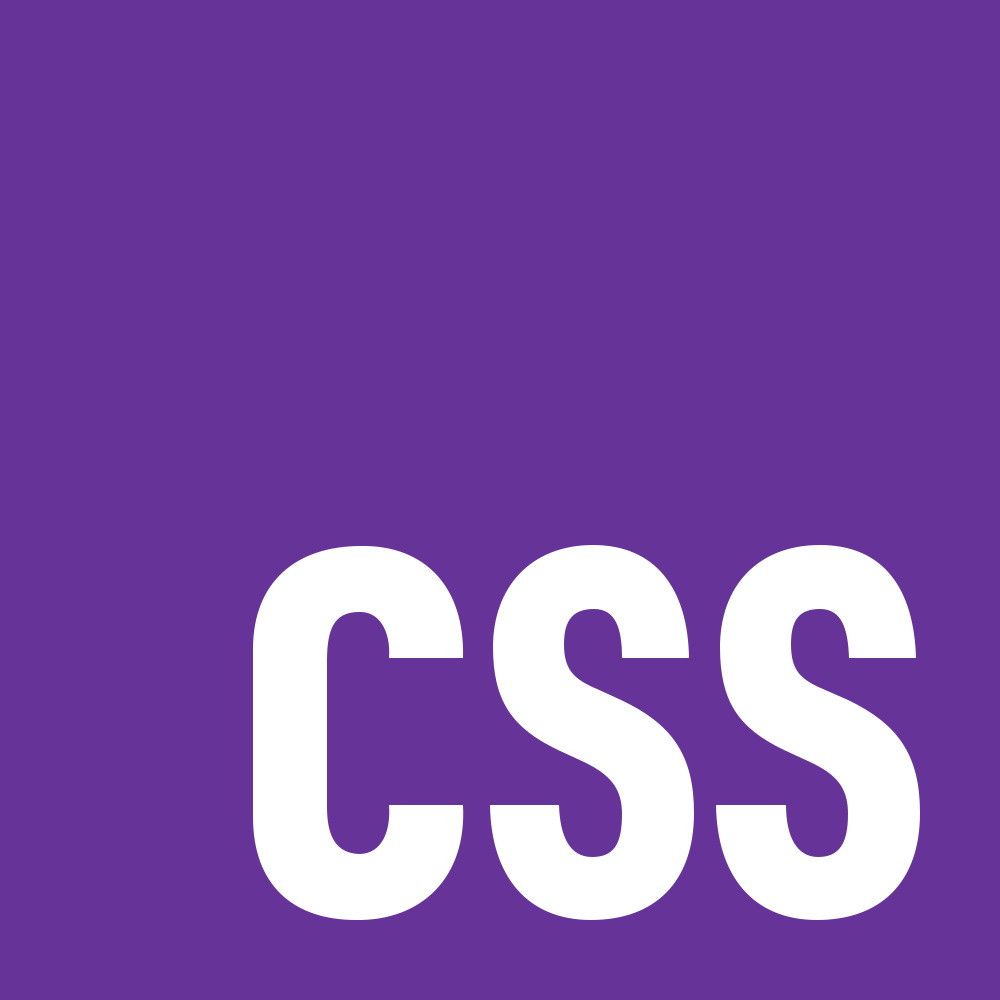

<h1 align="center">Hi 👋, I'm MrNizzy</h1>
<h2 align="center">A systems engineer / digital creator / frontend developer / writer from Colombia</h2>

 Fullstack developer with more than 2 years of experience in Angular, NestJS and SQL databases. I led the migration of a system to a decoupled architecture, achieving a 50% improvement in performance and scalability. Passionate about innovation and agile development.

       
      
      
       
   

<!-- Trabajo Independiente  -->
- 🚀 Currently working as a freelance programmer

- 📖 Currently learning **[Godot](https://godotengine.org/)**

- 📚 All of my projects are available at [https://github.com/MrNizzy](https://github.com/MrNizzy)

- 💼 How to reach me **[mr.nizzy@proton.me](mr.nizzy@proton.me)**

<h2 align="left">Connect with me:</h2>

<h2 align="left">Languages & tools</h2>

<h2 align="left">GitHub Stats</h2>

   
   

<h2 align="left">Most used languages</h2>

   

