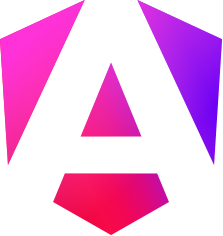
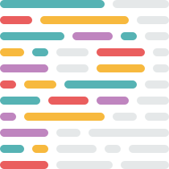
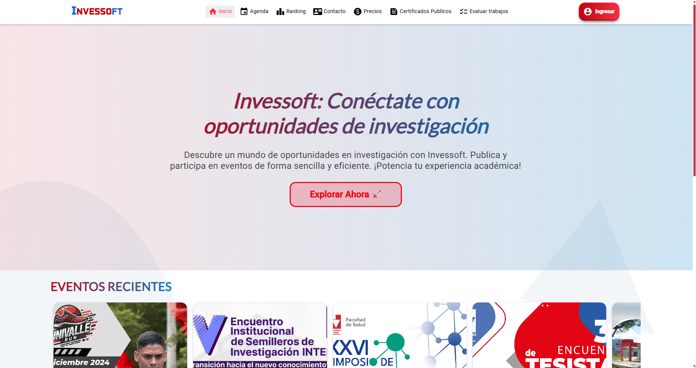
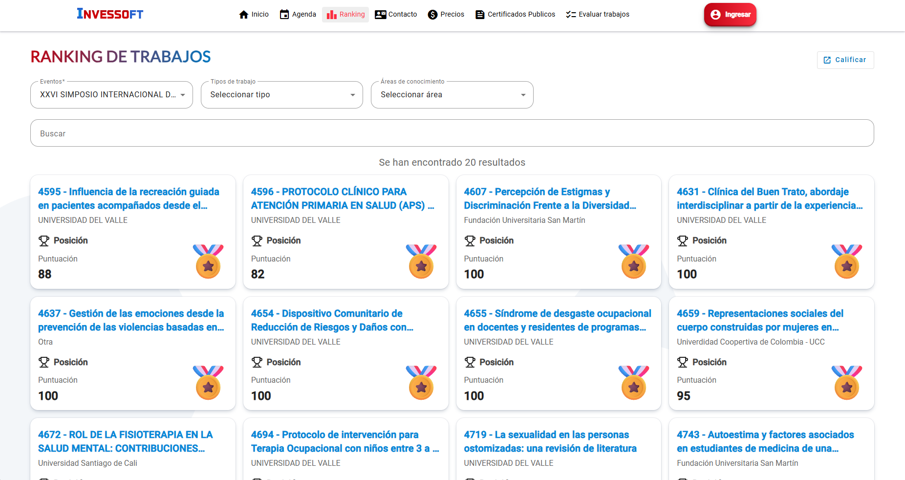
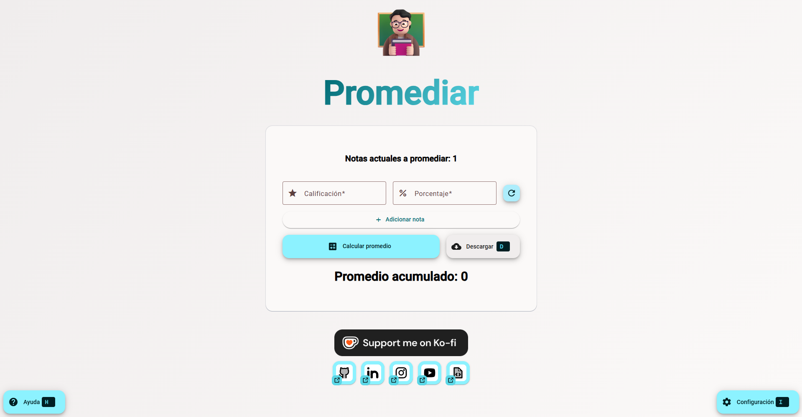
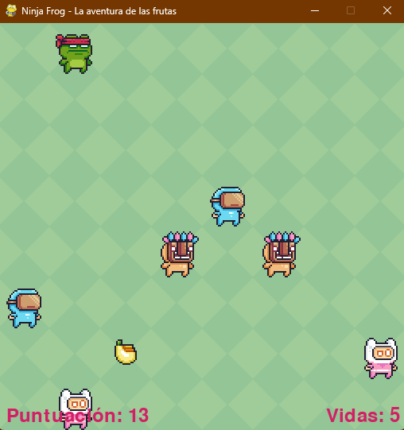
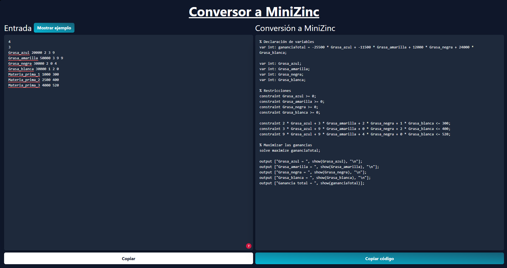

<h1 align="center">Hi 👋, I'm MrNizzy</h1>
<h2 align="center">A systems engineer / digital creator / frontend developer / writer from Colombia</h2>

 Fullstack developer with more than 2 years of experience in Angular, NestJS and SQL databases. I led the migration of a system to a decoupled architecture, achieving a 50% improvement in performance and scalability. Passionate about innovation and agile development.

       
      
      
       
   

<table>
    <tr>
        <td style="width: 40px;"></td>
        <td>Currently working as a freelance programmer</td>
        <td rowspan="7" style="width: 300px"></td>
    </tr>
    <tr>
        <td style="width: 40px;"></td>
        <td>Currently learning <a href="https://godotengine.org/">Godot</a></td>
    </tr>
    <tr>
        <td style="width: 40px;"></td>
        <td>All of my projects are available at <a href="https://github.com/MrNizzy">GitHub</a></td>
    </tr>
    <tr>
        <td style="width: 40px;"></td>
        <td>How to reach me: <a href="mailto:mr.nizzy@proton.me">mr.nizzy@proton.me</a></td>
    </tr>
    <tr>
        <td style="width: 40px;"></td>
        <td>Know about my experiences <a href="https://www.linkedin.com/in/mrnizzy/">LinkedIn</a></td>
    </tr>
    <tr>
        <td style="width: 40px;"></td>
        <td>Fun fact: I love to write, watch anime and play videogames</td>
    </tr>
    <tr>
        <td style="width: 40px;"></td>
        <td>I have a <a href="https://www.youtube.com/@MrNizzy">YouTube channel</a> where I talk about programming, videogames, technology and personal development</td>
    </tr>
</table>

<h2 align="left">Connect with me:</h2>
<table>
    <tr>
        <td></td>
        <td><a href="https://linkedin.com/in/mrnizzy" target="blank">LinkedIn</a></td>
    </tr>
    <tr>
        <td></td>
        <td><a href="https://instagram.com/mr.nizzy" target="blank">Instagram</a></td>
    </tr>
    <tr>
        <td></td>
        <td><a href="https://www.youtube.com/@MrNizzy" target="blank">YouTube Channel</a></td>
    </tr>
    <tr>
        <td></td>
        <td><a href="https://www.youtube.com/channel/UCyGeNSYTlHkZPCx08vtozVg" target="blank">YouTube Channel 2</a></td>
    </tr>
</table>

<h2 align="left">Languages & tools</h2>

<table>
    <tr>
        <td></td>
        <td></td>
        <td></td>
        <td></td>
        <td></td>
        <td></td>
        <td></td>
        <td></td>
    </tr>
    <tr>
        <td></td>
        <td></td>
        <td></td>
        <td></td>
        <td></td>
        <td></td>
        <td></td>
        <td></td>
    </tr>
    <tr>
        <td></td>
        <td></td>
        <td></td>
        <td></td>
        <td></td>
        <td colspan="3"></td>
    </tr>
</table>

<h2 align="left">Projects & works</h2>
<table>
    <tr>
        <td rowspan="3" style="width: 300px">
          
          
        </td>
        <td>
          <strong>
            
          </strong>
          </td>
    </tr>
    <tr>
        <td>
          <ul>
            <li>
              I migrated 85% of the system from Invessoft to Angular and NestJS, achieving a 50% improvement in performance and a 40% improvement in UI/UX.
            </li>
            <li>
              Optimized the configuration of VPS servers for Nginx and PM2, ensuring efficient deployments.
            </li>
            <li>
              I contributed to continuous system improvements in both the backend and frontend.
            </li>
            <li>
              Improved the system of permissions and profiles, improving scalability in new large and small functionalities.
            </li>
          </ul>
        </td>
    </tr>
    <tr>
        <td>
          <a href="https://invessoft.app/" target="_blank">
            Go to web site
          </a>
        </td>
    </tr>
    <tr>
        <td rowspan="3" style="width: 300px"></td>
        <td><strong>Promediar</strong></td>
    </tr>
    <tr>
        <td>
          A web application that allows students to calculate their weighted grade point average and determine how much they need in the last grade to pass the subject. This application was created with Angular using reactive forms and keyboard event handling to improve accessibility.
        </td>
    </tr>
    <tr>
        <td>
          <a href="https://promediar.netlify.app/" target="_blank">
            Go to web site
          </a>
          —
          <a href="https://github.com/MrNizzy/promediar-angular" target="_blank">
            Go to repository
          </a>
        </td>
    </tr>
    <tr>
        <td rowspan="3" style="width: 300px"></td>
        <td><strong>Ninja frog</strong></td>
    </tr>
    <tr>
        <td>
          It is a game created in Python using the Pygame library, this project was developed as a technical test and to practice logic concepts.
        </td>
    </tr>
    <tr>
        <td>
          <a href="https://github.com/MrNizzy/Ninja-Frog" target="_blank">
            Go to repository
          </a>
        </td>
    </tr>
    <tr>
        <td rowspan="3" style="width: 300px"></td>
        <td><strong>MiniZinc Converter</strong></td>
    </tr>
    <tr>
        <td>
          Complexity & Optimization project to convert the input value of an optimization problem as a parameter to return the value in code to be executed in the MiniZinc software.
        </td>
    </tr>
    <tr>
        <td>
          <a href="https://github.com/MrNizzy/convertidor-minizinc" target="_blank">
            Go to repository
          </a>
        </td>
    </tr>
</table>

<h2 align="left">GitHub Stats</h2>

   
   

<h2 align="left">Most used languages</h2>

   

